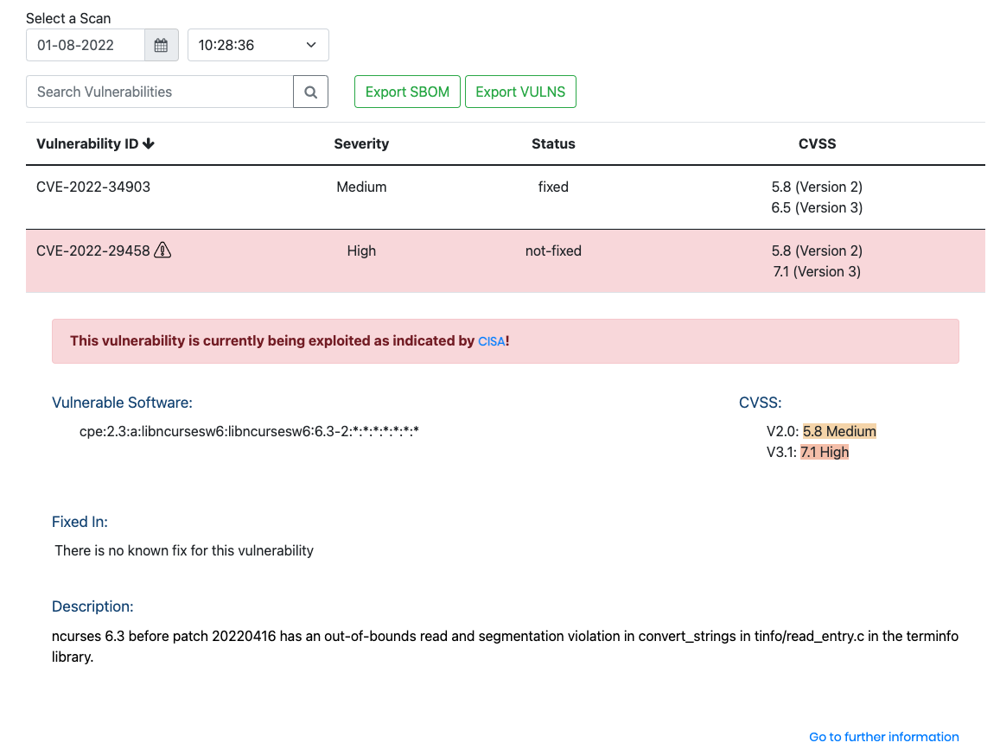

# Container Image Analysis in Build Pipelines
Scanning container images for vulnerabilities and generating signed provenance aligned with SLSA.
## tl;dr
This tool is built to perform container image analysis in build pipelines leveraging open-source tools. The artifacts generated for each container image are:
- 🗃 **Software bill-of-material (SBOM)** of all dependencies
- 🔍 Up-to-date **vulnerability scan** based on the generated SBOM
- 🔏 **Signed attestation** (verifyable artifacts)

A custom Github action integrated into the build pipeline of a image repository generates above artifacts and notifies a django-based application which collects the artifacts and stores them centrally. The information is visualized within a dashboard enabling an organisations security team to keeping tracover the organisations images, their dependencies and found vulnerabilities. To enhance supply chain security, signed provenance is generated within an attestation file in alignment with the SLSA framework.

    

Screenshots taken from the tools UI

## Introduction
With the digitalisation and the high degree of interconnectedness between firms, supply chain attacks have been on the rise. Security incidents such as those resulting from attacks like SolarWinds or Kaseya increased awareness and attention towards mitigating supply chain risks and investing into supply chain security.

Container images are often only scanned after they have been built and published to image registries. This allows 'unsafe' images to run in production. Integrating vulnerability scanning into the build pipeline which acts as a quality gate mitigates that risk. Having a precise overview of what dependencies are used within images as well as highlighting known CVEs, is necessary information organisations should be aware of. Versions that fix known vulnerabilities are indicated and provide a clear path to fix for developers. 
The action also generates attestation including build parameters for each image which is cryptographically signed to be verifyable afterwards.

## Tools and Frameworks Used
The tools build upon are all open-source and actively maintained. These are [Syft](https://github.com/anchore/syft) and [Grype](https://github.com/anchore/grype) which are maintained by [Anchore](https://github.com/anchore) as well as the [SLSA framework](https://slsa.dev/).

### Syft

### Grype

### Supply Chain Levels for Software Artifacts (SLSA)
SLSA is a security framework that has been developed to prevent tampering, improve integrity, and secure packages and infrastructure in projects. Under given conditions, an attacker could exploit various attack vectors within a supply chain. SLSA differs between 
- **source** integrity,
- build integrity, 
- and integrity of third-party dependencies

SLSA defines 4 levels of compliance that can be achieved with higher security requirements:

|   SLSA Level	|   Requirements	|
|:---:	|:---:	|
|   1	|   Documentation of the build process	|
|   2	|   Tamper resistance of the build service	|
|   3	|   Extra resistance to specific threats	|
|   4	|   Highest levels of confidence and trust	|

For a more detailled description of each level's requirements, please see the [official SLSA documentation](https://slsa.dev/spec/v0.1/levels).

Besides the [framework itself](https://slsa.dev/spec/v0.1/index) which is currently in alpha, the SLSA developers maintain a [repository](https://github.com/slsa-framework/slsa-github-generator) providing helpful tools to achieve SLSA compliance.

#### What SLSA artifacts does this project produce?
This project generates a signed provenance for scanned container images. The attestation is generated through signing a predicate file containing environment variables of the build process in a format which is compliant with the SLSA framework.

An example as well as the structure of the provanence artifact can be found [here](https://slsa.dev/provenance/v0.2).

### Pipeline

    

    

### Architecture

    

Our architecture consits of a container-based envapproach with Docker  because containers are lightweight and require less resources than VMs. Containers are easy to deploy, and can be deployed on any environment where Docker runs. Django web framework is used for our project because it is a high-level Python Web framework that encourages rapid development and clean, pragmatic design. Nginx is used as proxy and to deliver the statics, but this is not relevant for the concept behind it, therefore not in the graphic. A personal access token for GitHub is stored in Django. The account behind it has access to the runs of the actions of several repositories. Each repo performs image scanning as well as the generation of an SBOM. In order to keep the scanning with its databases as well as the creation of the SBOMs always up to date, the image used for this (along with the database behind it) is rebuilt daily. After the repos have been scanned, they send a notification to Django, which leads to the subsequent loading, saving and processing of the artifacts that result from a scan.

## Installation
1. Download and install Docker for your system as described here [How to install Docker](https://docs.docker.com/get-docker/)
2. Download this repository by running `git clone https://github.com/Root-DE/Applied-Cybersecurity-Django`
2. Create a copy of the [template.env](./template.env) file, rename it to `.env`, and fill it with your own values
3. Adapt the [nginx configuration file](./nginx/conf.d/nginx_django.conf) to your needs or remove the configuration file
4. Run `docker-compose up -d` to start the application. This will start nginx, the django application, the database and adminer where you can see the current state of the database. If you don't want to use adminer, you can remove the adminer container from the docker-compose.yml file.
5. Open your browser and go to https://your-domain/ to see the dashboard.
6. Set up the GitHub actions for each repository to trigger the scan by copying the [scan.yml](./.github/workflows/scan.yml) to the *.github/workflows/* directory of the respective repository. 

## User Interface Functionalities
### Authentication
Before having access to the platform itself and its findings , a user has to login first. The initial credentials for the admin should be set as described in [Installation](#installation).

    

User Authentication

### Dashboard Overview
The main landing page providing an overview over all repositories that are connected is the dashboard shown below. 

    

Dashboard

Each repository running the workflow is represented as a single card which shows the repository name and the information on the latest scan that ran:

- Timestamp
- Number of found dependencies in SBOM
- Number of Vulnerabilities

Hovering over the card shows the background which gives an overview of the risk categories of the vulnerabilities based on their CVSS score.

When using more than one organisation to structure Github repositories, the organisation filter can be used to only show repositories that belong to a specific organisation. When operating a high amount of repositories, the search functionality can be used to look for specific repositories. 

The search functionality can also be used to look for repositories that contain a specific CVE-ID to quickly identify potential risks.

### Details
By clicking on a repository-card, the detail page of that given repository is shown.
The detail page contains information on the repository itself as well as scans that ran. When clicking on the repository, details of the latest scan are shown.

    

Details - Time Series Graph

On the top of the details page, a time serias graph is shown that is displaying the amount of vulnerabilities found for each category, also based on the CVSS score.
By clicking on one of the past data points in the graph, the information for the selected scan is displayed on the page below. The database also integrates the vulnerability history so that the vulnerability information is up to date for the date it ran.

    

Details - Detail Data

Above screenshot shows the repository and scan information that is displayed. The box on the bottom-left is currently only a placeholder and shows the SLSA requirements for reaching specific levels of compliance. Work todo is currently listed in the section [Future Work](#future-work).

    

Details - Vulnerability Table

Scrolling down, the result of the vulnerability scan is shown. A scan can be selected using the date-time-picker. A search bar enables the user to look for specific vulnerabilities. Displayed information contain:

- CVE-ID
- Severity
- Status (Fix available?)
- CVSS Score

The SBOM as well as the vulnerability information is also written to the database as a whole. Using the export buttons, the SBOM as well as the vulnerability information can be exported for further processing.

By clicking one of the vulnerabilities, more information is shown so that the user is able to assess what the vulnerability itself is about and which dependencies and versions are vulnerable. 

    

Details - Vulnerability Specifics

Information on the vulnerable software versions, a fix (if existing), a description as well as a link to the official NVD database is included.

    

Details - Known Exploited Vulnerabilities

If one of the vulnerabilities that is found by Grype's vulnerability scan is within the "Known Exploited Vulnerabilities" list which is maintained by [CISA](https://www.cisa.gov/known-exploited-vulnerabilities-catalog), the vulnerability is marked as above to support prioritization within the vulnerability management process. Note: The above vulnerability is marked manually as currently being exploited to demonstrate the feature.

## Contributing

## Future Work
- Integration of more scanning tools
- Enhance the visualisation of the results
- Lifecycle Management (add more repositories, remove repositories)
- Advantages of that approach (SIEM, Rule Engines)
